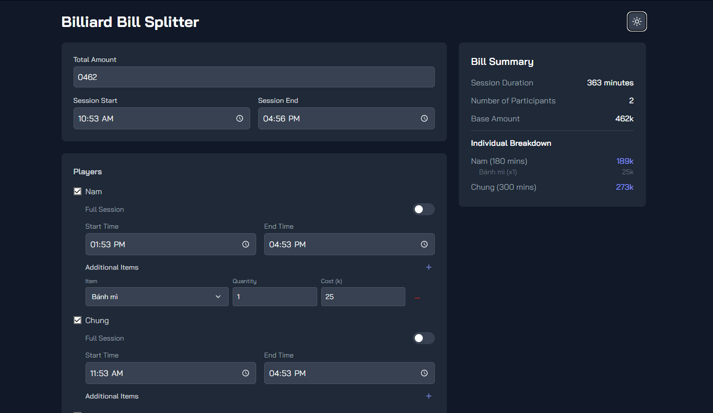
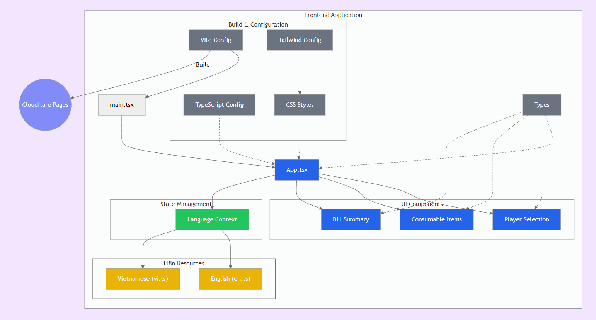

# NT Billiard Bill Splitter

Tool tính tiền chơi bi a cho mấy ae club NashTech, rảnh háng nên làm trong 1 buổi chiều



## Features

- Fully responsive, mobile friendly
- Crafted with modern UI (Tailwind with proper light/dark modes)
- Multi-languages support (support Vietnamese and English by defult, but additional languages can easily be added, check the i18n directory for language files)



## Demo

Check out the live demo: [NT Billiard Bill Splitter](https://chiabill.pages.dev)

## Installation

1. Clone the repository:
```bash
git clone https://github.com/yourusername/nt-billiard-bill-splitter.git
cd nt-billiard-bill-splitter
```

2. Install dependencies:
```bash
npm install
```

3. Start development server:
```bash
npm run dev
```

4. For production build:
```bash
npm run build
```

## Deployment

To deploy to Cloudflare Pages:

```bash
npm run pages:build
npm run pages:deploy
```

## Technologies Used

- React
- TypeScript
- Vite
- TailwindCSS
- Cloudflare Pages
